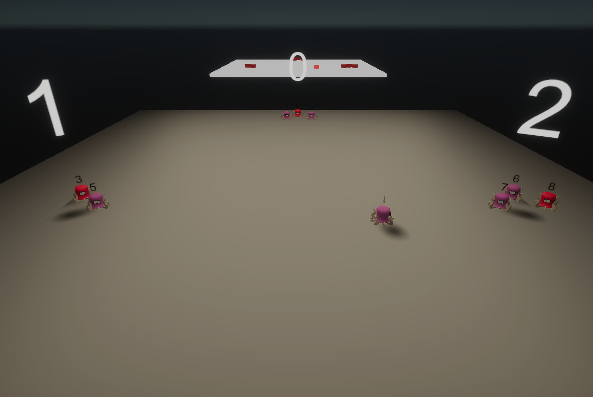
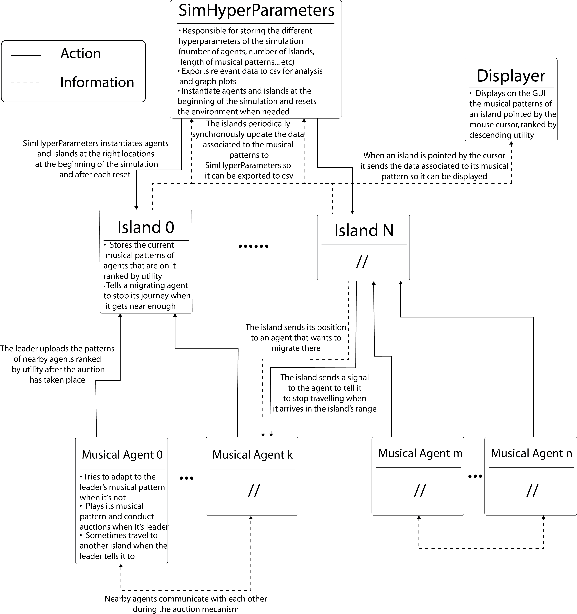
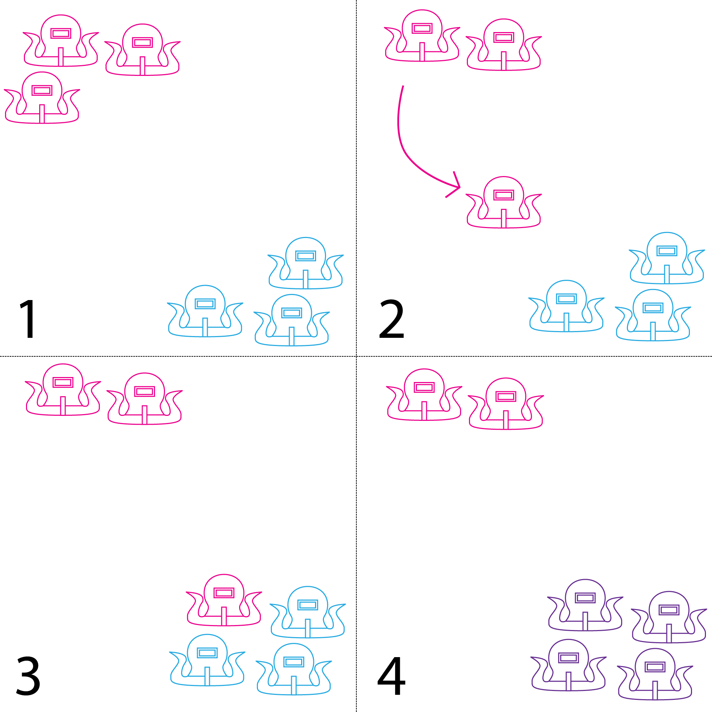
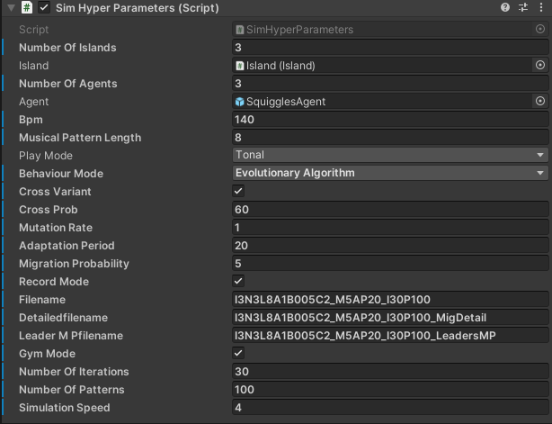

# SoloJam-Island

A general purpose Unity simulator to study rhythm dynamics in spatially segmented multi-agent systems.
In this simulation migrating musical agents try to bring the musical knowledge of their former environments to the new Island their arrive in.

## How it works

At first, the situation can be interpreted as though multiple instances of the
SoloJam algorithm detailed in chapter 1 work in parallel (1). Among those groups
agents propose performing solutions close to their leader’s musical pattern to take
the lead and play their musical pattern. However, sometimes when an agent is
“free”, i.e. not going to be designated as the next leader, it can decide to migrate to
another “island”, another subgroup where agents are playing (2). Upon arriving at
its new “island” the agent then follows the auction process of the group and tries
to take the leadership in its new environment (3). Because the agent comes from a
different “island” it brings with it the knowledge from its previous environment in
the form of its musical pattern. This pattern then influences the rest of the group if
the agent plays a solo because the other members will try to make their patterns
resemble the musical pattern of this migrating agent. With this process the
migrating agent has changed the search trajectory of the group which overcomes
the issue where agents’ patterns become stale because they only propose musical
patterns that are very similar (4).

## Simulation parameters

Most of the simulation parameters can be set through public variables in the SimHyperParameters object in the scene :

- **Number Of Islands** sets the number of Islands in the simulation.;
- **Number Of Agents** tells how many agents are initialized on each Island at the begining of each run.;
- **Bpm** is the number of beats per minute at which agents play their musical patterns.;
- **Musical Pattern Length** is the number of beats each musical patterns contains.;
- **Cross variant** enables or disables crossovers between an agent's musical pattern and the musical pattern of the leader of their Island. If it is enabled, these crossovers happen with a probability **Cross Prob** (in percents).;
- **Mutation Rate** indicates on average the number of bits that are being flipped after each mutation.;
- **Adaptation period** sets the number of musical patterns a migrating agent needs to adapt to their new Island.;
- **Migration Probability** is the probability for a migration to be initiated after each auction.;
- **Record Mode** enables or disables exports of the simulation results to csv.;
- **Gym Mode** enables/disables the repetition of multiple runs with a set **Number Of Patterns**.;
- **Simulation Speed** speeds up the simulation by this factor.;

Hyper parameters of the classical SoloJam algorithm can be set in the SquigglesAgent prefab through public variables.

## Packages needed

This simulator is built on Unity 2021.1.7f1 and uses Unity’s High-Definition Rendering Pipeline
to render the agents’ sensing range therefore this package needs to be included in your
Unity project. The not yet functional Unity ML-Agents based behavior of the musical
agents also necessitates ML-Agents version 1.0.8.
